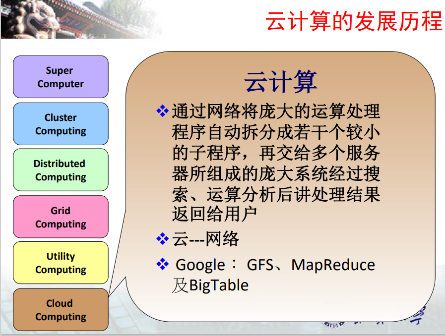

### 第1讲 初识云计算
#### 什么是云计算
云：规模较大、可伸缩性、边界模糊、飘忽不定，无法确定具体位置

#### 云计算的发展历程
- 超级计算机 
- 集群计算  1960
  - 将一组松散的计算机硬件通过软件集成、连接起来，紧密的协作完成计算工作
  - PVM、MPI
  - 相比超级电脑有较高性价比
- 分布式计算
  - 把需要进行大量计算的工程数据分割成小块，由多台计算机分别计算，然后上传计算结果，将结果统一合并得出最终结果。
  - Remote procedure calls(RPC)
- 网格计算  1990
  - 将大量异构计算机的未用资源（CPU时间和磁盘时间）作为嵌在分布式系统基础设施中的一个虚拟的计算机集群，为解决大规模的计算问题提供一个模型
  - Globus
- 效用（公用）计算
  - 提倡一种理想化的企业信息架构，让IT服务模仿公共服务的方式进行，如水、电力、煤气，“用多少付多少”“随需即用”
  - From IBM
- 云计算
  - 通过网络将庞大的运算处理程序自动拆分为若干个较小的子程序，再交给多个服务器所组成的庞大系统经过搜索、运算分析后将处理结果返回给用户
  - 云：网络
  - Google：GFS、Big Table、Map Reduce
#### 云计算的动因
- 芯片与硬件技术
  - 摩尔定律
  集成电路芯片上所集成的电路数目，每隔18个月就翻一倍，同时性能也提升一倍
  - 硬件能力↑ 成本↓  独立运作的公司集中客观的硬件能力->规模效益
- 资源虚拟化
  - 资源在云端，需要统一管理
  - 异构硬件、兼容性问题
  - 虚拟化技术
    - 开发人员只需关注业务逻辑，无需考虑底层资源的供给与调度问题
    - 硬件资源可以被细粒度的分割和管理，以服务的方式提供硬件和软件资源成为可能
    - 单点崩溃不会影响全局
    - 易创建性->使用更加方便，提高自身可靠性和可用性
- 面向服务的架构SOA
  - 开放式数据模型
  - 统一通信标准
  - 更加丰富的服务
  - 更加松散耦合、灵活的IT架构
  - 转变了人们对IT系统的认识 
- 软件及服务Saas
  - 转变了人们使用服务的方式
  - 使得终端用户熟悉服务的交互模式
  - 改变了IT界的商业模式
  - 大公司->基础设施，小公司->创新->挖掘潜力市场
  
- 互联网技术
  - 基础设施
  - 多种接入方式
  - 更加广阔的覆盖
  - 带宽和可靠性↑
  - 使得IT新模式的稳定性、可靠性、安全性、可用性、灵活性、可管理性、自动化程度、节能环保等得到保障
- Web2.0技术
  - 用户从信息的获得者变成信息的贡献者
  - 博客（微博）、内容聚合、百科全书（Wiki）、社交网络、对等网络（P2P）
  - 富互联网应用（Rich Internet Application）成为网络应用发展的趋势
  - 改变了人们的生活方式
  - 为云计算提出了内在需求
  > 和Web1.0的区别？
#### 业界主流的云计算产品
#### 典型的云计算应用/云服务
#### 深入了解现象背后“计算机”干了什么
#### 了解VMware、AWS、SAE

### 第3讲 云计算与服务
#### 服务的概念
#### 云的技术范畴
#### 云服务的基本层次
#### 云的特征
#### 云的优势
#### 什么是DevOps，DevOps有什么作用
#### 什么是中台，中台有什么作用，主要中台有哪些

### 第4讲 典型云服务
#### Iaas的基本功能
#### Paas的基本功能
#### Saas的典型应用

### 第5讲  虚拟化技术
#### 虚拟化的概念
#### 服务器虚拟化的特性
#### 服务器虚拟化的关键技术
#### 其他虚拟化的相关技术
#### 典型虚拟机
#### 虚拟化与云计算的关系

### 第6讲 虚拟化资源管理
#### AWS模式是什么，有什么优点？
#### Iaas模式核心需求有哪些
#### Open Stack都包含哪些核心项目，作用是什么
#### 镜像和实例有什么区别和联系
#### Nova有哪些核心模块，工作过程是什么
#### Keystone权限控制过程是什么
#### Quantum原理是什么
#### Cinder存储的机制是什么
#### Swift的核心概念有哪些
#### Swift的组件有哪些，都有什么作用

### 第7讲 云存储
#### 大规模数据存储面临的新问题与挑战
#### 索引技术
#### GFS体系结构
#### 云存储应用的特点

### 第8讲 批量计算
#### 并行化思想
#### 批量计算特点
#### Map Reduce算法的架构
#### Map Reduce算法设计思想
#### 算法调优
#### Map Reduce运行过程中的各种参数及其作用
#### 参数调优
#### 联系尝试写Map Reduce程序

### 第9讲 流式计算与图数据计算
#### 流式计算与批量计算的区别
#### 流式计算的关键要素
#### 数据分发机制
#### 运用流式计算方法解决实际问题
#### 图的切分方式
#### BSP计算模式
#### 图数据计算的并行思想
#### 运用图数据计算方法解决实际问题

### 第11讲 分布式处理框架
#### Hadoop项目的由来
#### HDFS的体系结构
#### HDFS的运行机制
#### Hadoop中Map Reduce的实现机制
#### Htable的数据结构
#### Hbase的运行机制
#### Yarn对Hadoop的核心改进
#### Spark架构及运行机制
#### Storm架构及运行机制
#### Kafka架构及运行机制
#### Pregel架构及运行机制
#### 各种分布式处理框架的异同点

### 第12讲 控制策略与保障技术1
#### 分布式处理的不一致情况有哪些
#### 有哪些原因造成了分布式处理的不一致
#### quorum protocol是什么
#### 主从机制下主和从的任务特点是什么
#### 数据库主从机制有哪些
#### Paxos算法过程是什么
#### PBFT算法过程是什么
#### Gossip算法过程和典型架构是什么

### 第13讲 控制策略与保障技术2
#### GFS容错机制
#### HDFS容错机制
#### 内存数据库容错机制
#### 计算框架容错机制
#### Ring算法是什么，有哪些改进
#### Zookeeper的实现机制是什么
#### 时间片机制有什么用，chubby释放和重连机制是什么
#### 多租户的概念是什么

### 第14讲 高级话题
#### 什么是云安全
#### 云计算的安全威胁
#### 云计算的安全优势
#### 物联网与云计算的关系
#### 什么是主机，什么是终端
#### 大型数据中心构建和管理主要需要做哪些事
#### 云计算中新人机制如何构建
#### NoSQL相较于传统数据库的特点
#### 常见的NoSQL数据类型和代表产品

### 第1讲
####  为什么有云计算
- 硬件需求
  - 变买为租
    - 成本压力
    - 只需要使用权，不注重所有权
  - 能力弹性
   - 硬件能力需求是弹性的
   - 希望能够按需扩展
  - 可靠性保障
    - 需要可靠但自身缺少相关保障技术
  - 管理维护
    - 需要管理维护但又无法承担成本
- 平台需求（开发者需求）
  - 变买为租
    - 成本压力
    - 只需要使用权，不注重所有权
  - 配置管理
    - 安装配置过程繁琐
    - 各种开发环境的冲突
    - 需要平台式一站式服务
  - 培训
  - 快速应对应用使用者的个性化新应用需求
- 应用需求
  - 更多的应用选择
    - 个性化
    - 需要更多提供商参与
  - 更方便的应用获取渠道
    - 应用商店
    - 试用
  - 参考信息
    - 他人的评价
    - 购买量
    - 开发者口碑