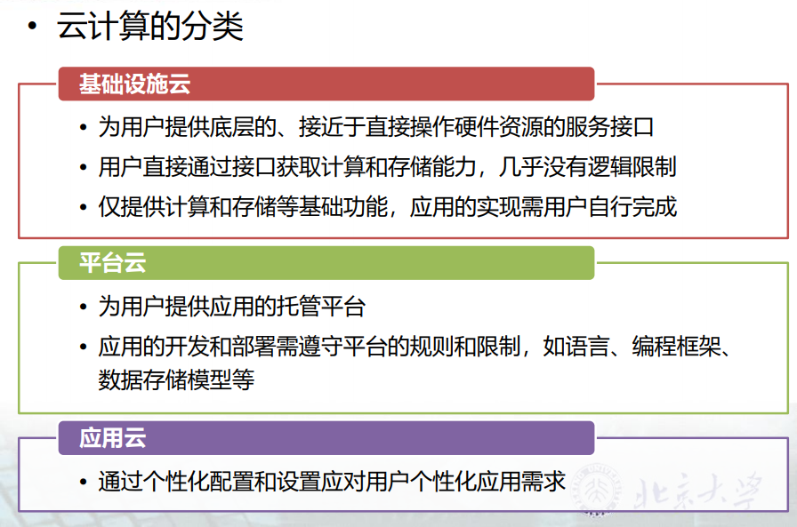

# 云计算复习笔记

[TOC]
### 第1讲 初识云计算
#### 什么是云计算
- 云：规模较大、可伸缩性、边界模糊、飘忽不定，无法确定具体位置
  - 一种服务
  - 提供了一种资源
  - 需要上网
  - 只关心使用，无需关心实现
  - 按需使用，按用付费
  - 多用户共享资源
  - 复杂的管理策略——分配、回收、隔离等等
  - 可靠性保障
- 云计算是一种能够将**动态伸缩**的**虚拟化资源**通过**互联网**以**服务**的方式提供给用户的计算模式
- 云计算是一种共享的网络交付信息服务的模式，云服务的使用者看到的只有服务本身，而不用关心相关基础设础的具体实现。 
#### 云计算的发展历程
Iaas发展基于虚拟化，Paas发展基于分布式并行计算技术
|    阶段    |        特点        |
| :--------: | :---------------: |
| 超级计算机 |  单机  |
| 集群计算   |  协同计算 |
| 分布式计算 | 分别计算，统一合并 |
| 网格计算   | 未用资源作为分布式系统的虚拟机群 |
| 效用计算   | 公共服务化 |
| 云计算     | 大程序拆成小程序交给多个服务器 |   
##### 超级计算机  
##### 集群计算  1960 
  - 将一组松散的计算机硬件通过软件集成、连接起来，紧密的协作完成计算工作
  - PVM、MPI
  - 相比超级电脑有较高性价比
##### 分布式计算
  - 把需要进行大量计算的工程数据分割成小块，由多台计算机分别计算，然后上传计算结果，将结果统一合并得出最终结果。
  - Remote procedure calls(RPC)
##### 网格计算  1990
  - 将大量异构计算机的未用资源（CPU时间和磁盘时间）作为嵌在分布式系统基础设施中的一个虚拟的计算机集群，为解决大规模的计算问题提供一个模型
  - Globus
##### 效用（公用）计算
  - 提倡一种理想化的企业信息架构，让IT服务模仿公共服务的方式进行，如水、电力、煤气，“用多少付多少”“随需即用”
  - From IBM
##### 云计算
  - 通过网络将庞大的运算处理程序自动拆分为若干个较小的子程序，再交给多个服务器所组成的庞大系统经过搜索、运算分析后将处理结果返回给用户
  - 云：网络
  - Google：GFS、Big Table、Map Reduce
#### 云计算的动因
- 技术成熟
  - 资源虚拟化技术
  - 互联网带宽可靠性
  - Web2.0
- IT企业的成熟和计算力过剩，集中大量硬件实现规模效益
[摩尔定律](#moer)
- 社会需求的膨胀和商业模式的扩大
  - 面向服务架构SOA
  - Saas

#### 业界主流的云计算产品
#### 典型的云计算应用/云服务
Google
12306
VMware
GAE/SAE

#### 深入了解现象背后“计算机”干了什么
#### 了解VMware、AWS、SAE

### 第3讲 云计算与服务
#### 服务的概念
通过一系列活动，而不是实物，满足对方的需求
- 以**用户需求的满意度**为核心
- **活动**为主，实物为辅或无实物

**特点**
- 针对个性化需求
- 顾客参与度提升
- 更大的价值体现
- 以顾客的满意度衡量
#### 云的技术范畴
- **资源服务化**
  - 虚拟化的计算和存储资源
  - 运行应用的平台
  - 种类繁多的互联网应用
  - 服务的可伸缩性、可用性和安全性。
- **资源虚拟化**（资源的抽象化描述）
  - 分布式并行计算系统（海量、高并发）
  - 资源管控（分配回收策略）
#### 云服务的基本层次
- 横向
  - 公有云(Internet)
  - 私有云(Intranet)
  - 混合云(Internet 和 Intranet)
- 纵向
  - SaaS  应用软件
面向最终用户
  - PaaS  开发软件或支撑软件
面向应用软件
  - IaaS  基础硬件
面向软件

#### 云的特征
- **分工协作**：硬件和软件都是资源
- **按需分配**：资源可以根据需要进行动态扩展与配置
- **租用**：按用计费、无需管理
- **对用户不可见**：物理上分布式共享，逻辑上以单一整体呈现

#### 云的优势
- **规模效应** 优化产业成本
  - 硬件->电力、散热
  - 分散的、高能耗模式->集中的、资源友好模式
  - 自给自足资源作坊->规模效应的工业化资源工厂
- **针对性强** 推进专业分工
  - 大型云计算厂商
  - 科研团队 -> 硬件技术革新
  - 维护管理团队和配套软件
  - 新产业契机
- **资源分配负载** 提高资源利用率
  - 更高效解决常规业务
  - 更好的应对突发任务或事件
  - 更加平衡的资源分配和负载
- 减少初期投资
  - 更少的**IT基础设施**投入 
  - 更少的**软件**投入 
  - 更少的**人力**投入 
  - 更短的**培训**周期 
  - 更灵活的转型支持
- **系统灵活性** 降低管理开销

#### 什么是DevOps，DevOps有什么作用

- **服务需求**：提高不同团队间的协同效率，降低成本
- **主要目标**：全面监控+自动化

- **实施**：组织、技术、流程、文化

- 动因
  - 开发≠上线
  - 配套技术的发展：微服务、容器
  - 敏捷开发的诉求（用户的压力）
  - 开发的自动化（IDE环境强大）
- **核心功能**
  - 自动打包
  - 自动升级部署
  - 用例管理和自动执行
  - 用例开发框架
  - 用例执行框架

#### 什么是中台，中台有什么作用，主要中台有哪些
- 中台不是：中间逻辑层/PaaS/中间件/平台
- 中台就是将“后台”中那些针对技术，业务，组织的通用“模块/服务”从原来特定的项目中抽离出来，并且使之能够成为一个自治的服务复用到多个项目中提供给更多的“前台”使用
- **对后台的进一步抽象和拆分**
- 主要中台

|  中台   | 实例 |
| :-----: | :----------: |
| **业务中台** |  零售行业、线上线下、多渠道多模式   会员管理、订单管理... |
| **应用中台** |   存储、音视频会议系统、电子发票... |
| **技术中台** |  数据存储与管理、数据分析处理、功能API、消息发布订阅... |
| **数据中台** |   业务数据、分析数据、管理数据、日志数据... |

 
 

### 第4讲 典型云服务
|  层次 |       功能          |         特点       |        实例      |
| :----:| :-----------------: | :---------------: | :---------------:|
| [Iaas](#Iaas)  |资源抽象  资源监控 负载管理   数据管理  资源部署 安全管理 计费管理 |交付给用户的是基本的**基础设施资源**：  网络带宽; 计算单元—处理器机时; 存储单元—存储空间 用户无需购买、维护硬件设备和相关系统软件 直接在基础设施即服务上构建自己的平台和应用 使用**最灵活，但难度最大**，需要用户**完全自主**构建平台和应用|Amazon EC2:Xen虚拟化技术；提供计算资源；数量+时间方式计费 S3(Simple Storage Service):提供存储资源
| [Paas](#Paas)  |开发平台 运行时环境 运营环境|交付给用户的是丰富的**中间件资源** - 应用容器 - 数据库  - 消息处理  面向**软件人员**而非终端用户|J2EE;淘宝;Google App Engine|
| [Saas](#Iaas)  | 丰富|交付给用户的是**定制化的软件**  将软件或应用以**租用**的形式提供给用户  用户无需本地安装软件副本，无需维护相应的硬件资源  软件通过**网络**交付给用户，用户端只需**浏览器或客户端工具** 软件即服务面向**多个**用户，但每个用户感觉其**独享**该服务|Google Docs Salesforce CRM Mushup

#### Iaas的基本功能
  1. 资源抽象 
  2. 资源监控 
  3. 负载管理 
  4. 数据管理 
  5. 资源部署 
  6. 安全管理 
  7. 计费管理

##### 资源抽象
- 对**硬件**进行**虚拟化**
- 基于硬件驱动/接口
- **屏蔽硬件产品差异**
  - 向下，针对不同硬件产品建立不同的适配器
- 对硬件进行统一的管理逻辑
  - 向上，提供统一的标准的管理逻辑接口
- 核心问题：对资源进行**粒度**划分并管理
  - 单一资源的粒度划分
  - 多种资源的组合打包
- 粒度分级概念 
  -  虚拟机（Virtual Machine）
  - 集群（Cluster）
  - 虚拟数据中心（Virtual Data Center）
  - 云（Cloud）
- **将物理资源放入统一的资源池中** 
- 对资源池进行管理并呈现给用户
##### 资源监控
- 保障基础设施层高效工作的**关键**
- 是**负载管理**的**前提** 
- 调用资源本身的监控接口
- 对**不同资源**采取**不同监控**方式 
  - 计算单元——使用率 
  - 存储单元——使用率、读写操作 
  - 网络—实时的输入、输出及路由状态
- 不同的监控层次 
  - 根据资源粒度层次 
  - 上级监控结果是下级监控结果的整合 
- 不同的监控对象 
  - 物理单元 
  - 逻辑单元
  - 解决方案 
- 定义监控事件和触发规则 
  - 业务逻辑的体现 
  - 当xxxx时，需要做xxxx事情 
  - 自动化管控的实现基础
##### 负载管理
- 负载过低 -> 资源浪费
- 负载过高 -> 上层服务受到影响
- **负载均匀**
可留空节点
- 避免负载过高

- 关闭的越多
  - 资源浪费↓（电力等）
  - 平均负载↑
  - 性能影响↑
- 负载平衡与优化问题
  - 性能
  - 资源
  - 优化算法
##### 数据管理
- **多种数据并存**
  - 结构化XML数据
  - 非结构化二进制数据
  - 关系型数据库数据
- 物理上**分布式**存储
- 数据的**完整性、可靠性、可管理性**提出挑战
  - 完整性(log)
    - 数据的状态在任何时候都是确定的
    - 可以通过操作恢复到一致的状态
    - 任何时候都能够被正确的读
    - 写操作进行适当的同步
  - 可靠性
    - 数据的损坏和丢失几率降到最低
    - **冗余**备份与恢复
  - 可管理性
    - 提供相应的操作支持**粗粒度、逻辑简单**的管理
##### 资源部署
- 通过自动化部署流程将资源交付给上层应用
- 使基础设施服务变得**可用**的过程
- 分次部署
  - 初期，虚拟化硬件资源就绪时进行初始化
  - 应用运行时，进行动态部署
- 部署方式随基础设施层构建技术不同有巨大差异
- **虚拟化技术简化**了资源部署的过程

**典型场景**
- **支持动态资源可伸缩性**
  - 用户的服务工作负载过高时，可以通过增加服务实例的方式降低负载
  - 云自动分配所需资源
  - 例如：网络游戏用户激增
- **故障恢复与硬件维护**
  - 多节点的数据冗余—鸡蛋放在不同的篮子中
  - 快速复制环境完成物理迁移
##### 安全管理
- 保证基础设施资源被**合法**地访问和使用
- **合法性**
正确的用户、程序、分配
- 云数据的**安全**
操作审查、授权、追踪机制
- 环境更加开放
- 用户不保有数据 
- 云内部破坏力更大 
- 影响云安全的因素 
  - 恶意程序 
  - 硬件故障 
  - 云管理人员泄露数据 
  - 外在因素（灾害、盗窃）
##### 计费管理
- 变买为租
- **按量、按时间**计费
- 使用情况监控
- 用户任务的多种实现方式

#### Paas 的基本功能
1. 开发平台
2. 运行时平台
3. 运营环境

##### 开发平台
- 平台层是其上运行的应用的开发平台
- **应用模型**(E.g. J2EE)
  - 编程语言 
  - 应用的元数据模型 
  - 应用的打包发布格式
- **API代码库**
平台层为其上开发应用而提供的统一服务
  - 界面绘制
  - 消息机制
  - 减少重复工作
  - 缩短开发周期
  - 云平台可以包含多方提供的代码库
  - 更好的开放性
  - 更丰富的API
- 必要的**开发测试环境**
  - 在线的应用开发测试环境
  - 服务器端完成所有工作
  - 开发人员无需安装和配置开发软件
  - 需要平台层提供良好开发体验
  - 网络稳定
  - 足够的带宽
  - 离线开发测试+上传模式
##### 运行时环境
- 开发测试完毕后，对应用进行部署上线
- 应用**打包**
- **上传**到远程平台
- 解析元数据信息对应用进行**配置**
- 不同平台层用户完全独立
- 有可能产生配置冲突
- **隔离性、可伸缩性、资源的可复用性**
  - 隔离性
  业务、数据、应用（隔离工作区）、用户间（用户：独享；系统：多租户技术）
  - 可伸缩性
  动态资源（计算能力、存储、网络带宽）分配
    - 分配依据：工作负载、业务规模
  - 资源的可复用性
     与可伸缩性相关；释放、回收；宏观无限，微观有限
##### 运营环境
- 应用更新（功能添加、版本升级）
- 升级（补丁）
- 监控 
  - 应用运行状态（工作负载、出现异常）  
  - 监控手段（响应时间、吞吐量、工作负载、处理的请求量）
  - 图形化展示
- 资源消耗监控（初次分配、实时、统计报表） 
- 应用卸载（直接、备份卸载、卸载说明、协议） 
- 应用计费统计（资源使用、业务使用）

#### Saas的典型应用
分类：长尾理论

- 标准应用
Google Docs
  - 代码运行在平台层 
  - 服务质量要与本地运行差别不大 
  - 丰富的功能vs远程通信效率
- 客户应用
Salesforce CRM
  - 通用模板
  - 一定程度的定制化
  - 云应用的迁移是巨大问题
  现有->云端；一个云提供商->另一个；blog的迁移
- 多元应用
  - 多元数据融合Mushup
  - 开放应用程序接口
  - E.g.基于Goolgle Map的应用

### 第5讲  虚拟化技术
#### 虚拟化的概念
#### 服务器虚拟化的特性
#### 服务器虚拟化的关键技术
#### 其他虚拟化的相关技术
#### 典型虚拟机
#### 虚拟化与云计算的关系

### 第6讲 虚拟化资源管理
#### AWS模式是什么，有什么优点？
#### Iaas模式核心需求有哪些
#### Open Stack都包含哪些核心项目，作用是什么
#### 镜像和实例有什么区别和联系
#### Nova有哪些核心模块，工作过程是什么
#### Keystone权限控制过程是什么
#### Quantum原理是什么
#### Cinder存储的机制是什么
#### Swift的核心概念有哪些
#### Swift的组件有哪些，都有什么作用

### 第7讲 云存储
#### 大规模数据存储面临的新问题与挑战
#### 索引技术
#### GFS体系结构
#### 云存储应用的特点

### 第8讲 批量计算
#### 并行化思想
#### 批量计算特点
#### Map Reduce算法的架构
#### Map Reduce算法设计思想
#### 算法调优
#### Map Reduce运行过程中的各种参数及其作用
#### 参数调优
#### 联系尝试写Map Reduce程序

### 第9讲 流式计算与图数据计算
#### 流式计算与批量计算的区别
#### 流式计算的关键要素
#### 数据分发机制
#### 运用流式计算方法解决实际问题
#### 图的切分方式
#### BSP计算模式
#### 图数据计算的并行思想
#### 运用图数据计算方法解决实际问题

### 第11讲 分布式处理框架
#### Hadoop项目的由来
#### HDFS的体系结构
#### HDFS的运行机制
#### Hadoop中Map Reduce的实现机制
#### Htable的数据结构
#### Hbase的运行机制
#### Yarn对Hadoop的核心改进
#### Spark架构及运行机制
#### Storm架构及运行机制
#### Kafka架构及运行机制
#### Pregel架构及运行机制
#### 各种分布式处理框架的异同点

### 第12讲 控制策略与保障技术1
#### 分布式处理的不一致情况有哪些
#### 有哪些原因造成了分布式处理的不一致
#### quorum protocol是什么
#### 主从机制下主和从的任务特点是什么
#### 数据库主从机制有哪些
#### Paxos算法过程是什么
#### PBFT算法过程是什么
#### Gossip算法过程和典型架构是什么

### 第13讲 控制策略与保障技术2
#### GFS容错机制
#### HDFS容错机制
#### 内存数据库容错机制
#### 计算框架容错机制
#### Ring算法是什么，有哪些改进
#### Zookeeper的实现机制是什么
#### 时间片机制有什么用，chubby释放和重连机制是什么
#### 多租户的概念是什么

### 第14讲 高级话题
#### 什么是云安全
#### 云计算的安全威胁
#### 云计算的安全优势
#### 物联网与云计算的关系
#### 什么是主机，什么是终端
#### 大型数据中心构建和管理主要需要做哪些事
#### 云计算中新人机制如何构建
#### NoSQL相较于传统数据库的特点
#### 常见的NoSQL数据类型和代表产品

### 第1讲
####  为什么有云计算
- 硬件需求
  - 变买为租
    - 成本压力
    - 只需要使用权，不注重所有权
  - 能力弹性
   - 硬件能力需求是弹性的
   - 希望能够按需扩展
  - 可靠性保障
    - 需要可靠但自身缺少相关保障技术
  - 管理维护
    - 需要管理维护但又无法承担成本
- 平台需求（开发者需求）
  - 变买为租
    - 成本压力
    - 只需要使用权，不注重所有权
  - 配置管理
    - 安装配置过程繁琐
    - 各种开发环境的冲突
    - 需要平台式一站式服务
  - 培训
  - 快速应对应用使用者的个性化新应用需求
- 应用需求
  - 更多的应用选择
    - 个性化
    - 需要更多提供商参与
  - 更方便的应用获取渠道
    - 应用商店
    - 试用
  - 参考信息
    - 他人的评价
    - 购买量
    - 开发者口碑

#### 分类  
- 服务类型
  - 基础设施云
  - 平台云
  - 应用云

  |     分类    |       服务类型          | 灵活性 | 难易程度 |
  | :--------: | :--------------------:  | :----: | :-----: |
  | 基础设施云  | 接近于原始的计算存储能力 |   高   |   难    |
  |   平台云    |    应用的托管环境       |   中   |   中    |
  |   应用云    |    特定功能的应用       |   低   |   易    |

 
- 服务方式
  - 公有云
  - 私有云
  - 混合云

#### 动因

- 芯片与硬件技术
  - 摩尔定律
  集成电路芯片上所集成的电路数目，每隔18个月就翻一倍，同时性能也提升一倍
  - 硬件能力↑ 成本↓  独立运作的公司集中客观的硬件能力->规模效益
- 资源虚拟化
  - 资源在云端，需要统一管理
  - 异构硬件、兼容性问题
  - 虚拟化技术
    - 开发人员只需关注业务逻辑，无需考虑底层资源的供给与调度问题
    - 硬件资源可以被细粒度的分割和管理，以服务的方式提供硬件和软件资源成为可能
    - 单点崩溃不会影响全局
    - 易创建性->使用更加方便，提高自身可靠性和可用性
- 面向服务的架构SOA
  - 开放式数据模型
  - 统一通信标准
  - 更加丰富的服务
  - 更加松散耦合、灵活的IT架构
  - 转变了人们对IT系统的认识 
- 软件及服务Saas
  - 转变了人们使用服务的方式
  - 使得终端用户熟悉服务的交互模式
  - 改变了IT界的商业模式
  - 大公司->基础设施，小公司->创新->挖掘潜力市场
  
- 互联网技术
  - 基础设施
  - 多种接入方式
  - 更加广阔的覆盖
  - 带宽和可靠性↑
  - 使得IT新模式的稳定性、可靠性、安全性、可用性、灵活性、可管理性、自动化程度、节能环保等得到保障
- Web2.0技术
  - 用户从信息的获得者变成信息的贡献者
  - 博客（微博）、内容聚合、百科全书（Wiki）、社交网络、对等网络（P2P）
  - 富互联网应用（Rich Internet Application）成为网络应用发展的趋势
  - 改变了人们的生活方式
  - 为云计算提出了内在需求
  > 和Web1.0的区别？
### 第3讲
#### 交互平台的本质
- 建立一个池，对池中资源放入取出
- 服务可以重复利用           ->取出和放回 
- 服务能力单位时间具有排他性  ->资源竞争
- 宏观上服务能力无限 ->通过池弹性扩展
- 微观上服务能力有限 ->分配回收管控

#### 交互平台的共性问题
- 服务（包括资源）的描述与访问问题——虚拟化
- 大规模的处理的效率问题——分布式计算
- 资源的分配回收及其他管控问题——管控策略

#### 云与服务
- 云计算——新的服务模式及使能技术
  - 资源服务化
  - 虚拟化的计算和存储资源
  - 运行应用的平台
  - 种类繁多的互联网应用
  - 服务的可伸缩性、可用性和安全性
云计算通过不同层次的架构实现不同类型的服务以及满足用户对这些服务的各种需求。
- 云是一种平台模式，把资源汇聚，然后再以服务的方式对外提供
- 云计算技术是云这种平台模式的使能技术
狭义：面向IT资源服务
广义：广泛的资源服务

### 第4讲
#### Iaas
- 基础设施层服务
  - 经过虚拟化后的硬件资源和相关管理功能的集合
  - 硬件资源：计算、存储和网络等资源
  - 通过虚拟化技术对物理资源进行抽象
  - 内部流程自动化
  - 资源管理优化
  - 对外提供动态、灵活的资源服务

##### 实现步骤
1. 总体设计
2. 服务流程
  规划、部署、运行

###### 总体设计
- 建立物理设施
- 虚拟化
- 建立管理系统
- 建立服务

- 虚拟化平台
暴露统一接口
- 虚拟化集成管理器
  - 提供基础设施层管理的核心功能
  - 调用虚拟化平台提供的接口
  - 管理虚拟的硬件资源
- 基础设施层服务
  - 与虚拟化集成管理器提供的功能相对应
  - 用户获得接触设施层资源的接口

###### 服务流程
1. 规划
  - 虚拟化
    - 物理环境就绪
    - 通过虚拟化软件对物理服务器进行改造
    - 整合计算资源
    - 建立统一访问接口
      - 对虚拟机进行操作
      - 获取各种资源的信息
  - 用户访问及管理
    - 基础设施层允许用户远程访问、获取资源
    - 下载客户端程序
      - 获得对基础设施层的访问逻辑
      - 保障通信安全的证书和密钥
      - 获取现有资源列表
      - 选择虚拟机类型
      - 进行部署、运行等操作
  - 数据管理
    - 业务数据的管理
      - 传统数据管理办法
    - 虚拟镜像文件的管理
      - 镜像文件是二进制数据
      - 包含虚拟机配置、操作系统类型、软件堆栈等等
      - 模板可供不同用户重复使用
      - 模板+自定义镜像上传
      - 空余较大
      - 压缩存储
      - 增量备份
2. 部署
  - 虚拟机或虚拟解决方案的部署
  - 分配资源
  - 虚拟机内部配置文件描述资源配置
  - 接收虚拟化集成管理器的激活命令
  - 启动配置实例
3. 运行
  - 对虚拟机进行管理 
    - 黑盒管理 
    - 白盒管理 
    
  - 资源监控 
  通过黑盒管理与白盒管理共同完成
  - 负载管理 
    - 基于资源管理
    - 依赖黑盒管理和白盒管理机制
    - 白盒管理得到虚拟机自身负载
    - 黑盒管理进行负载协调
      - 当虚拟机所在物理服务器仍有可用资源时，从虚拟机本地物理服务器获取资源（实时）
      - 当虚拟机所在物理服务器可用资源不足时，通过虚拟机的实时迁移进行资源整合（实时）
      - 协调各物理服务器负载（非实时）
  - 安全管理
    - 贯穿整个运行阶段
    - 分层次管理
      - 虚拟化平台的管理域 
        - 只运行必要的服务 
        - 防火墙控制对管理域的访问 
        - 禁止用户访问 
      - 虚拟化集成管理器 
        - 访问的安全认证 
        - 服务消息中包含安全认证信息 
        - 对所有访问进行跟踪与记录 
      - 虚拟机
        - 不同软件的安全管理 
  - 用户服务 
    - 账户计费服务 
      - 基于资源监控和负载管理 
      - 虚拟机的配置 
      - 使用时间 
      - 负载管理复杂程度 
      - 服务质量
    - 运行监控服务
      - 用户希望了解自己系统的情况 
        - 实时状态 
        - 历史信息 
      - 基于资源监控和负载管理 
      - 日志信息 
      - 统计图表 
      - 手动优化

#### Paas
- 平台层服务
  - 介于基础设施层和应用层之间
  - 具有通用性和可复用性的软件资源集合
  - 为云应用提供开发、运行、管理和监控的环境
  - 优化了的“云中间件”
  - 更好的满足云应用的可伸缩性、可用性和安全性
- 常见的平台
  - 基于**快速开发**目的的**技术平台**
  - 基于**业务逻辑复用**的**业务平台**
  - 基于**系统自维护、自扩展**的**应用平台**
##### 总体设计
E.g. J2EE

**开发平台**
- 应用模型：J2EE
- 服务提供方式： REST SOAP
- 核心API：SDK
- 发布格式：JAR包
- 开发测试环境：Eclipse、Jbuilder...

**运行环境**
可伸缩实现机制

机制1：应用服务器与数据库服务器**之间**打包配置
机制2：**分别**
>两种机制优缺点？

**运营环境**
- J2EE平台上升级和卸载的标准流程
- 平台层定制化操作
##### 云平台上开发应用的优势
- 提供高级编程接口，**简单易用**，缩短编程人员上手时间
- 应用的开发与运行基于相同的平台，**兼容性**问题较少
- 开发者无需考虑应用的**可伸缩性、服务容量**问题
- 平台层的运营管理功能还能够帮助开发人员对应用进行**监控和计费**
- Google
**GAE**
Google App Engine
  - Web应用开发平台
  - 对Web应用的**无状态计算**和**有状态存储**进行分离
  - 对Web应用使用的**资源**进行分配
  - 具有良好的**自动可伸缩性和高可用性**
#### Saas
- 云上应用软件的集合
- 建立在基础设施层提供的资源和平台层提供的环境之上
- 以软件接口（web service、REST等）API方式
- 通过互联网而非单机提供
- 轻客户端，云端支持的典型方式
- 种类繁多

|应用|功能|实例|
|:-: | :-: | :-: |
|面向广大受众的标准化应用|满足用户日常生活办公需求|登录认证 文档编辑 日程管理|
|定制的个性化服务应用|面向企业和机构用户的解决方案|财务管理 供应链管理 客户关系管理 物流管理|
|用户开发的多元化应用|独立软件开发商或第三方团队开发|为满足极为特定需求的创新应用 一般在公有云上创建|

##### 特征
- 网络访问模式
  - 通过浏览器访问
  - 具有开放的API，允许用户或者瘦客户端调用
- 租用付费
  - 无需一次性购买投入
  - 按用付费
  - 注册
- 高度整合
  - 用户需求的综合性
  - 用户体验为导向

##### 优点
- 商业、技术模式的升级
- 用户无需关心软件的安装和升级
- 无需一次性投入购买软件
- 软件开发者而言，可以方便的进行产品的部署与升级
- 更有利于知识产权的保护
- Salesforce CRM，Google Gmail
